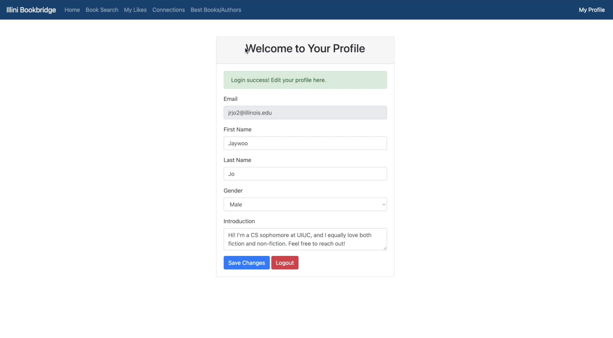
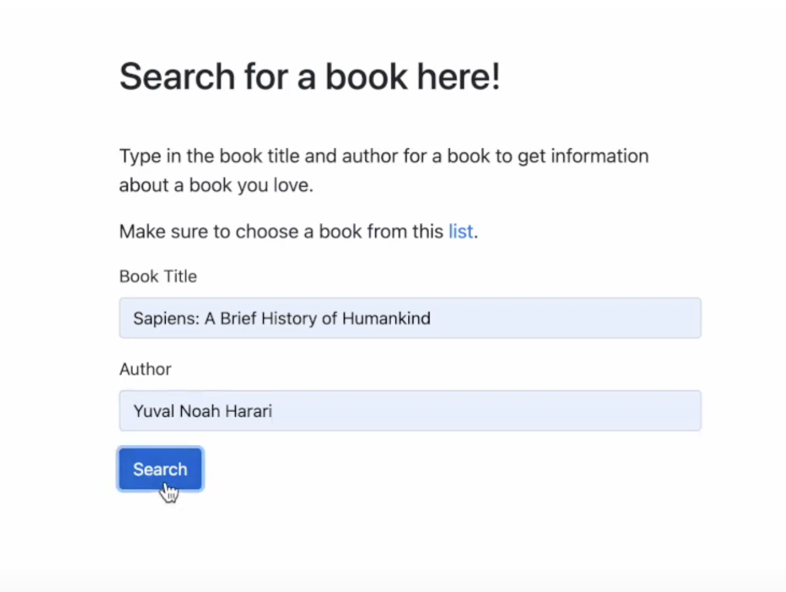
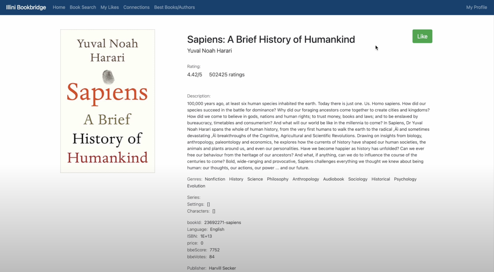
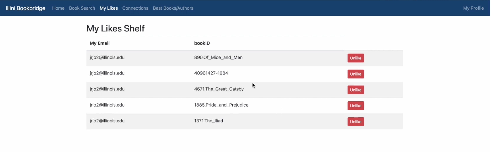

# Illini Bookbridge (Team019-DreamTeam)
By Jaywoo Jo, Ruhana Azam, John Shen, Alan Zhang

### Demo Video
[Demo Video](https://www.youtube.com/watch?v=WaINe_qyNMA&ab_channel=JayJo)

### Summary
Illini BookBridge is an application that allows students at the University of Illinois to not only get
information about their favorite books, but to also connect with other students who share the
same book interests.  

This application draws its inspiration from Goodreads, a social website which allows individuals to
search its database of books, annotations, quotes, and reviews from other readers.

However, it does what Goodreads cannot do – strike a conversation. Due to privacy concerns on
the internet, people are not comfortable with sharing their social media accounts or meeting
in-person to discuss the books with strangers on the internet. However, this application requires
users to create an account with an @illinois.edu email, creating an extra level of security. This
application will prove very useful because many college students enjoy reading and connecting
with their peers. Illini BookBridge offers Illinois readers a chance to be connected, start a
conversation on the books they like, and even make friends.

1. This application allows users to search for a book and retrieve all kinds of book information such
as genre, author, publisher, awards, etc. Users can add books to their likes shelf.
2. The social component allows students to connect with
other students who have the same tastes in books as them. If a user wishes to connect with another user,
the student will be provided with the other person’s contact information so they can get
connected and possibly form a book community.

<table>
  <tr>
    <td> Sign Up with a valid @illinois email </td>
    <td> Edit your public profile </td>
  </tr>
  <tr>
    <td valign="top"></td>
    <td valign="top"></td>
  </tr>

  <tr>
    <td> Search for a book </td>
    <td> and get your results. </td>
    <td> View your likes shelf. </td>
  </tr>
  <tr>
    <td valign="top"></td>
    <td valign="top"></td>
    <td valign="top"></td>
  </tr>

  <tr>
    <td> Form connections! </td>
  </tr>
  <tr>
    <td valign="top"></td>
  </tr>
 </table>

### App Info
Built with Node.js, Express, JS/JQuery. Using a MySQL database hosted on Google Cloud Platform (GCP). CSS/HTML/Bootstrap for front-end. 

Built off of a developed ER diagram. Performed index analysis and incorperated stored procedures and triggers.
    <tr>
        <td valign="top"></td>
    </tr>

### How to run the application
To run the server, (1) add a .env file with our GCP DB_HOST, DB_NAME, DB_USER, and DB_PASS. (2) npm install (3) npx nodemon server.js (4) open http://localhost:8080/ in browser

Our server currently is running locally because it is easier to work on due to GCP VM SSH lagging issues. 
